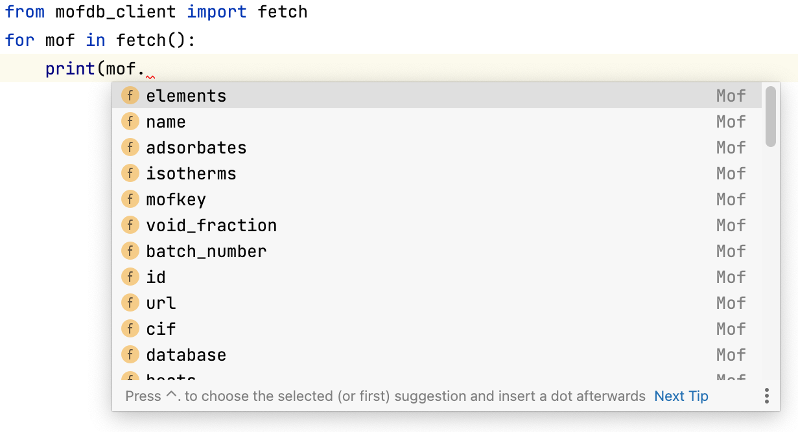

# mofdb-client

A typed lightweight client wrapping the [mofdb api](https://mof.tech.northwestern.edu/api).

### Installation

```shell
python3 -m pip install mofdb_client
```

### Example



```python3
from mofdb_client import fetch
for mof in fetch(vf_min=0.5, vf_max=0.99):
    print(f"Mof {mof.name} has {len(mof.isotherms)} isotherms and elements {[str(e) for e in mof.elements]}")
    print(f"This mof's cif file starts with: '{mof.cif.splitlines()[1]}'")
```

```
Mof UTEWUM_clean has 2 isotherms and elements ['Cu', 'H', 'C', 'N']
This mof's cif file starts with: '_audit_creation_date              2014-07-02'
Mof ZECKID_clean has 1 isotherms and elements ['Cu', 'H', 'C', 'N', 'O']
This mof's cif file starts with: '_audit_creation_date              2014-07-02'
Mof AQOMAW_clean has 2 isotherms and elements ['N', 'C', 'H', 'Co', 'Cl', 'O']
This mof's cif file starts with: '_cell_length_a       18.8345'
Mof AQOLOJ_clean has 2 isotherms and elements ['N', 'C', 'H', 'Co', 'Cl']
This mof's cif file starts with: '_cell_length_a       18.794'
Mof SENWOZ_clean has 2 isotherms and elements ['Zn', 'H', 'C', 'O']
This mof's cif file starts with: '_audit_creation_date              2014-07-02'
Mof IYUCIQ_clean has 2 isotherms and elements ['Dy', 'O', 'N', 'C', 'H']
This mof's cif file starts with: '_cell_length_a       29.162'
Mof ORUKET_clean has 2 isotherms and elements ['P', 'O', 'N', 'C', 'H', 'Mg']
This mof's cif file starts with: '_cell_length_a       18.571'
...
```

### Parameters
*fetch* supports a number of arguements
- pressure_units: str
- loading_units: str
- mofid: str 
- mofkey: str 
- vf_min: float 
- vf_max: float 
- lcd_min: float 
- lcd_max: float 
- pld_min: float 
- pld_max: float 
- sa_m2g_min: float 
- sa_m2g_max: float 
- sa_m2cm3_min: float 
- sa_m2cm3_max: float 
- limit: int
- telemetry: bool default true (see telemetry section)

For valid values of pressure_units go here [mof.tech.northwestern.edu/classifications.json](https://mof.tech.northwestern.edu/classifications.json). The mofdb_client will reject invalid
units/pressures and throw `InvalidUnit` exception.

### Design Note
`fetch` is lazy because mofDB is large. Be sure to loop over it with `for mof in fetch()` and NOT `for mof in list(fetch())` since 
building the list will download all the mofs before it starts processing and this will be very slow and may well run out of memory.

### Compatibility
Tested on Python 3.9 likely to work on any 3.x.

### Future Enhancements:
- [ ] Retries for transient network failures with exponential backoff

- [X] Support for unit conversions

- [ ] Only download some columns to save time/bandwidth?

### Telemetry
This package may report crashes/calls to fetch in library code when the telemetry arg is true. This is done using 
[sentry](https://docs.sentry.io/). Nothing in addition to fetch params and data captured by default by sentry is ever
captured.

For example this could include:
- a stack trace including your code
- operating system version
- time
- python runtime version
- hostname
- anything else sentry captures by default

### Publishing a new version
Update pyproject.toml version

```
python3 -m build -n
python3 -m twine upload dist/*
```


